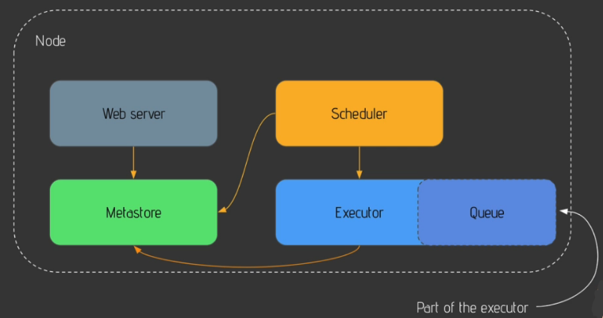
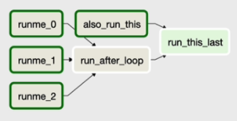
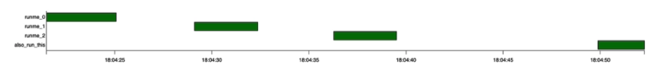

# Getting started with Airflow

## What is Airflow?

Apache Airflow is an open source platform to programmatically author, schedule, and monitor workflows. It works as an orchestrator to execute the tasks in the right order and at the right time. Airflow is extensible. We can make plugins for Airflow to integrate with other tools not readily available.

Airflow core components:

- **Web server:** Airflow uses a Flask server with Gunicorn serving the UI.
- **Scheduler:** Daemon in charge of scheduling workflows.
- **Metastore:** database where all metadata related to your workflows will be stored. Recommended DB is PostgreSQL, but any SQL-Alchemy compatible DB can be used.
- **Executor:** this is a Python class that defines how the tasks will be executed.
- **Worker:** is the process or sub-process that executes the task

Airflow core concepts:

- **DAGs:** tasks are represented in DAGs. They map dependencies.
- **Operator:** wrapper around the task
  - Action operators execute functions or commands.
  - Transfer operators allow us to transfer data from a source to a destination
  - Sensor operators wait for an event before moving on to the next task
- **Task:** a task is an operator in the data pipeline
- **Task instance:** a task that is being executed
- **Workflow:** the combination of all previous concepts

## How Airflow works?

The single node architecture uses a single machine to run workflows. The Web server fetches data coming from the Metastore. The Scheduler and the Executor will talk with the Metastore to run the workflows as needed, and report back the status of the workflows. The Executor has a Queue which defines the order in which the tasks are executed.



The multi node architecture allows you to run as many tasks as needed. In this architecture, the first node will run the Web Server, the Scheduler, and the Executor. The second node will run the Metastore, and the Queue. Worker nodes will be in charge of running the tasks. 


All python scripts that describe the workflows will be stored in a directory accessible by both the Web server and the Scheduler. These will parse the file in order to be aware of the DAGs. Once parsed, the Scheduler will create a DAGRun object and communicate it to the Metastore. Once a DAGRun object is present in the Metastore, a Task Instance object will be created for the Executor to utilize. Once the Executor runs the Task Instance object, it will update the status of it in the Metastore. Each time the status in the Metastore is updated, the Web UI is updated.

## Airflow CLI

Once Airflow has been installed, run

``` zsh
airflow db init
```

to initiate the Airflow Metastore and generate the following files in the environment:

- `airflow.cfg` the Airflow configuration file
- `airflow.db` a SQLite DB for the Airflow Metastore
- `log` subdir where logs for the tasks will be stored
- `unittests.cfg` configuration files for unit tests
- `webserver_config.py` the web server configuration file

To start the Airflow UI run

``` zsh
airflow webserver
```

Check the `localhost:8080` to make sure the server is running properly.

### Create admin user

To create the first admin user run

``` zsh
airflow users create -u <user_name> -p <user_password> -f <user_first_name> -l <user_last_name> -r <user_role> -e <user_email>
```

The first user you create should have an `Admin` rol. Now you can access the Airflow user interface with admin capacity.

#### Upgrade Airflow

To upgrade Airflow run

``` zsh
airflow db upgrade
```

#### Reset Airflow DB

To reset the Airflow DB use

``` zsh
airflow db reset
```

but keep in mind that this will erase everything in the Airflow Metastore.

#### Start Scheduler

To start the Airflow Scheduler run

``` zsh
airflow scheduler
```

#### List all DAGs

To list all DAGs run

``` zsh
airflow dags list
```

This will list all example DAGs that come with Airflow plus any DAG that you've already created.

#### List the tasks

To get a list of the tasks in a DAG run

``` zsh
airflow tasks list <dag_id>
```

#### DAG triggering

To trigger the execution of a DAG at a specific date run

``` zsh
airflow dags trigger -e <date_in_yyyy-mm-dd> <dag_id>
```

## Airflow UI

The most important View in the UI is the DAGs view. Here you'll see all the data pipelines. The toggle switch will allow you to Pause and Unpause the DAG. If it's off, the DAG will not run even you try triggering it manually.

Next you'll see the name of the datapipeline along with its tags. After that comes the name of the team or person who owns that data pipeline. Next you'll see the Runs column. In this column you can see whether the DAG is `success`, `running`, or `failed` state.

The Schedule interval column specifies the frequency with which the pipeline will run, in Cron nomenclature. To the right you can see the execution date of the last run, followed by the status of the recent tasks (last DAG run).

Lastly, you'll find the action buttons to a) trigger the DAG manually, b) refresh it (for example, after updating it), c) delete it (this will not delete the file, just the metadata), and d) links to other views of the data pipeline.

If you click on the DAG name, you'll be re-directed to the tree view. On the right hand you can see the history of the DAG runs and its tasks. Circles correspond to DAG runs, and squares correspond to the tasks.

In the Graph view you can get an image of the pipeline in the form of a DAG. Boxes correspond to the DAGs tasks, and arrows correspond to their dependencies. The color of the boxes represent their status.



With the Gantt view you can get a plot that explains how long each task took to run. The longer the box, the longer the task took to run. If two or more tasks where run in parallel, this will be reflected on the graph.


