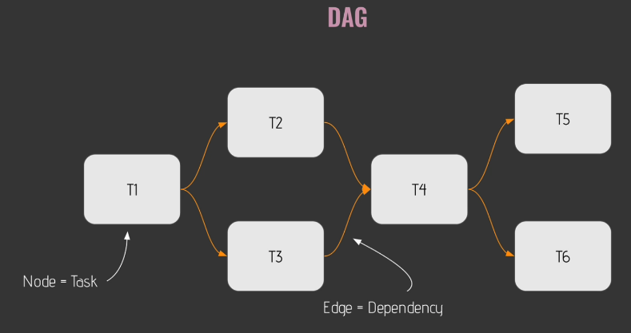
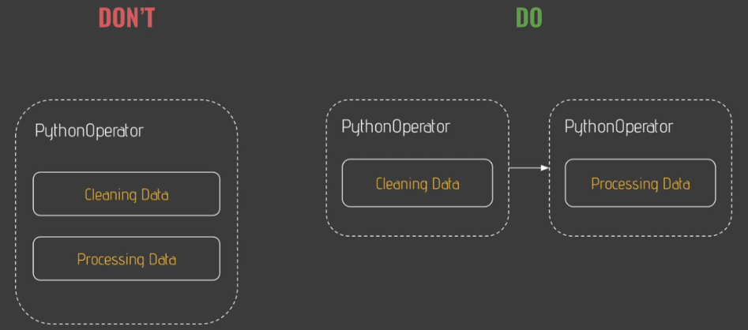

# Creating data pipelines

A DAG is a data pipeline in Airflow. It is a graph that describes how the different tasks that make up the pipeline relate (depend on) to each other. There can be no loops in the graph as these would represent circular dependencies.



## DAG directory

The DAGs directory is not included out of the box. To create it, `cd` to the `airflow` directory, and run

``` zsh
mkdir dags
```

All the python files need to be placed in there. Each file will represent a DAG. In this example pipeline we'll create 5 tasks:

- `creating_table` will create the table where the users will be stored. To do this, we will use the `SQLite` operator.
- `is_api_available` will check if the API from where we are going to fetch the users is available. To do this, we'll use the `HTTP` sensor.
- `extracting_user` will fetch the user. This will be done with the `HTTP` operator.
- `processing_user` will run some python function to process the data that the API sent. This will be done using the `Python` operator.
- `storing_user` will store the processed user in the table that we created. To do this, we will use the `Batch` operator.

We'll start with creating a `user_processing.py` file in which we will define the DAG.

## Operators

An operator is a task in the data pipeline. Always make sure to define one task per operator. This will ensure that if one task fails, only that task is retried.



There are three types of operators:

1. **Action** operators execute an action (for example, the `Python` operator, the `Batch` operator, etc)
2. **Transfer** operators transfer data from a source to a destination
3. **Sensor** operators are used to wait for a condition to be met before moving on to the next task

## Testing tasks

Each time we add a task to the data pipeline, we need to test it. To test a task run

``` zsh
airflow tasks test <dag_id> <task_id> <execution_date_in_yyyy-mm-dd_format>
```

This will test only the task. It will not check for dependencies, nor will it store any metadata.
